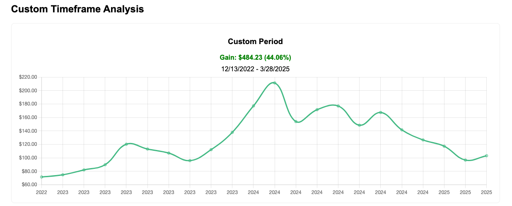

### **Introduction**  
The [PowerColor Red Devil RX 7900 XTX](https://amzn.to/3LP0wlf) was a gamer's dream in 2022. But if you'd invested that $1,099 in AMD stock instead, you'd have **$1,583 today** (+44%) while your GPU depreciated. Let's explore this tech investment crossroads.

---

#### **The Numbers Don't Lie**  
| Choice              | Initial Cost (12/2022) | Value Today (3/2025) | ROI    |
|---------------------|-----------------------|----------------------|--------|
| RX 7900 XTX Purchase | $1,099                | ~$600*               | -45%   |
| AMD Stock Investment | $1,099                | **$1,583**           | +44.06%|

*Based on used market prices  

  
**Gain**: $484.23 (44.06%)  
**Timeframe**: 12/13/2022 - 3/28/2025  

---

#### **Key Takeaways**  
1. **The AI Savior**: AMD's data center revenue grew 287% during this period  
2. **Hybrid Approach**: Buying both the GPU and 5 AMD shares ($317) would now be worth $1,100 total  
3. **Gamer Reality**: Newer [RX 8900 XT](https://amzn.to/4pvITFr) makes old GPUs obsolete faster than stocks  

---

### **2025 Recommendations**  
- **For Gamers**: [RX 7900 XTX Clearance Deals](https://amzn.to/49CVFgQ)  
- **For Investors**: [Try Our Updated AMD Calculator](https://stockgainscalculator.com/)  

---
### **Visual Credits**  
*GPU photo by [Brecht Corbeel](https://unsplash.com/@brechtcorbeel), Chart via StockGainsCalculator*  

---

### **Affiliate Disclosure**  
*As an Amazon Associate, I earn from qualifying purchases.*  
