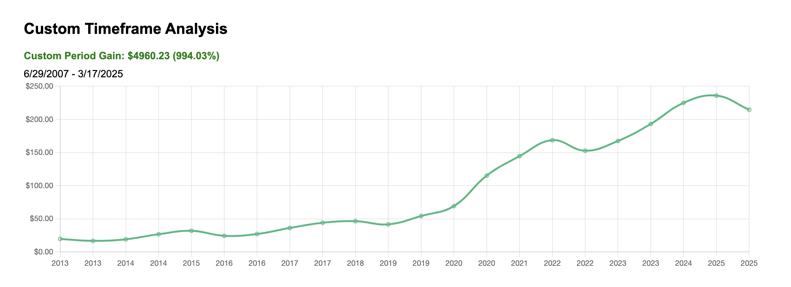

### **Introduction**  
The [iPhone 1](https://amzn.to/4pmUExS) revolutionized the smartphone industry and Apple’s business. But did you know it also transformed Apple’s stock? Let’s explore how much you’d have today if you invested in Apple back in 2007—and how you can enjoy the best of both worlds: cutting-edge tech like the [iPhone](https://amzn.to/4ri9Y0s) and smart investing.  

---

#### **The iPhone 1 Launch**  
On **June 29, 2007**, Apple launched the first [iPhone](https://amzn.to/4rfvtin), changing the tech landscape forever.  
The [iPhone 1](https://amzn.to/4rfvtin) was priced at **$499 for the 4GB model** and **$599 for the 8GB model**.  

#### **Apple Stock Price in 2007**  
At the time of the [iPhone 1](https://amzn.to/4rfvtin) launch, Apple’s stock was trading at just **$3.30 per share** (adjusted for splits).  

#### **Investment Growth Calculation**  
If you had invested the cost of an [iPhone 1](https://amzn.to/4rfvtin) in Apple stock instead, here’s how much you’d have today (as of **March 17, 2025**):  

**For the 4GB Model ($499 Investment):**  
- $499 would have bought **~151 shares** of Apple stock.  
- Based on your custom timeframe analysis, the investment would be worth **$5,459.23** today.  
  - **Custom Period Gain:** $4960.23 (994.03%)  

**For the 8GB Model ($599 Investment):**  
- $599 would have bought **~181 shares** of Apple stock.  
- Based on your custom timeframe analysis, the investment would be worth **$6,553.26** today.  
  - **Custom Period Gain:** $5954.26 (994.03%)  

#### **Visualizing the Growth**  
Here’s a breakdown of the growth over time:  

**Custom Timeframe Analysis for iPhone 1 (4GB Model - $499):**  
  
**Custom Period Gain:** $4960.23 (994.03%)  
**Timeframe:** 6/29/2007 - 3/17/2025  

**Custom Timeframe Analysis for iPhone 1 (8GB Model - $599):**  
  
**Custom Period Gain:** $5954.26 (994.03%)  
**Timeframe:** 6/29/2007 - 3/17/2025  

#### **Key Takeaways**  
- Investing in Apple stock when the [iPhone 1](https://amzn.to/4rfvtin) launched would have been a game-changer, yielding **10x returns** or more.  
- The [iPhone 1](https://amzn.to/4rfvtin) was a groundbreaking device, and Apple’s stock growth shows the power of investing in innovative companies.  
- You don’t have to choose between enjoying cutting-edge tech like the [iPhone](https://amzn.to/4rfvtin) and building wealth—both can be part of a balanced financial strategy.  

---

### **Call to Action**  
- Use our [Stock Gains Calculator](https://stockgainscalculator.com) to explore similar scenarios for other stocks and see how investing can work for you.  
- If you’re ready to upgrade to the latest [iPhone](https://amzn.to/4rfvtin), check out the [iPhone 16 on Amazon](https://amzn.to/4rfvtin) and enjoy the best of today’s technology.  

---

### **Conclusion**  
The [iPhone 1](https://amzn.to/4rfvtin) was a revolutionary product, and investing in Apple stock at the time would have been an incredibly smart move. While past performance doesn’t guarantee future results, this example shows the potential of long-term investing in innovative companies. Whether you’re buying the latest [iPhone](https://amzn.to/4rfvtin) or investing in the stock market, the key is to make informed decisions that align with your goals.  

---

### **Investing Resources**  
For more investing tips and tools, check out our [Investing Resources](/categories/investing).  

---

### **Photo Credit**  
*Photo by [Mediamodifier](https://unsplash.com/@mediamodifier) on [Unsplash](https://unsplash.com/).*  

---

### **Affiliate Disclosure**  
*As an Amazon Associate, I earn from qualifying purchases.*  
