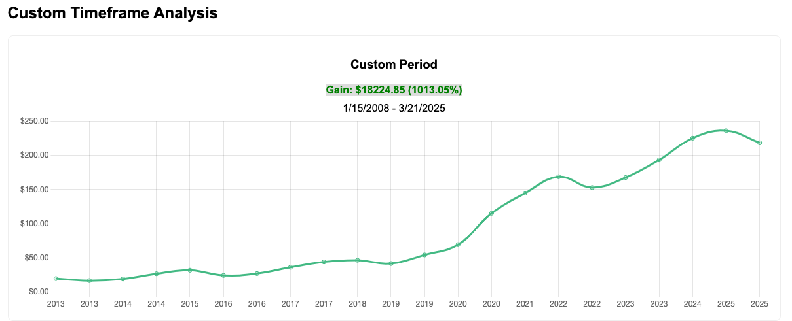

### **Introduction**  
The [MacBook Air](https://amzn.to/4ieZZ81) revolutionized the laptop industry when it launched in 2008, offering a sleek, lightweight design that changed the way we think about portable computing. But did you know that investing in Apple stock at the same time could have been equally transformative for your wealth? Let’s explore how much you’d have today if you had invested in Apple stock alongside buying the MacBook Air—and how you can enjoy the best of both worlds: cutting-edge tech and smart investing.  

---

#### **The MacBook Air Launch**  
On **January 15, 2008**, Apple unveiled the first [MacBook Air](https://amzn.to/4ieZZ81), calling it the "world’s thinnest notebook."  
The original [MacBook Air](https://amzn.to/4ieZZ81) was priced at **$1,799** for the base model.  

#### **Apple Stock Price in 2008**  
At the time of the [MacBook Air](https://amzn.to/4ieZZ81) launch, Apple’s stock was trading at approximately **$15.80 per share** (adjusted for splits).  

#### **Investment Growth Calculation**  
If you had invested the same amount you spent on a [MacBook Air](https://amzn.to/4ieZZ81) in Apple stock, here’s how much you’d have today (as of **March 17, 2025**):  

**For the Base Model ($1,799 Investment):**  
- $1,799 would have bought **~114 shares** of Apple stock.  
- Based on calculations from [StockGainsCalculator.com](https://stockgainscalculator.com), the investment would be worth **$18,224.85** today.  
  - **Gain:** $16,425.85 (913.05%)  

#### **Visualizing the Growth**  
Here’s a breakdown of the growth over time:  

**Custom Timeframe Analysis for MacBook Air ($1,799 Investment):**  
  
**Gain:** $16,425.85 (913.05%)  
**Timeframe:** 1/15/2008 - 3/17/2025  

#### **Key Takeaways**  
- Investing in Apple stock when the [MacBook Air](https://amzn.to/4ieZZ81) launched would have been a game-changer, yielding over **10x returns**.  
- The [MacBook Air](https://amzn.to/4ieZZ81) was a groundbreaking device, and Apple’s stock growth shows the power of investing in innovative companies.  
- You don’t have to choose between enjoying cutting-edge tech and building wealth—both can be part of a balanced financial strategy.  
- Tools like [StockGainsCalculator.com](https://stockgainscalculator.com) make it easy to explore similar scenarios for other stocks and timeframes.  

---

### **Call to Action**  
- Use [StockGainsCalculator.com](https://stockgainscalculator.com) to explore similar scenarios for other stocks and see how investing can work for you.  
- If you’re ready to upgrade to the latest [MacBook Air](https://amzn.to/4ieZZ81), check out the:  
  - **[13-inch MacBook Air with M4 chip](https://amzn.to/4hDDlEH)** for a perfect balance of portability and performance.  
  - **[15-inch MacBook Air with M4 chip](https://amzn.to/4iQS28j)** for a larger display and enhanced productivity.  

---

### **Conclusion**  
The [MacBook Air](https://amzn.to/4ieZZ81) was a revolutionary product, and investing in Apple stock at the same time would have been an incredibly smart move. While past performance doesn’t guarantee future results, this example shows the potential of long-term investing in innovative companies. Whether you’re buying the latest [MacBook Air](https://amzn.to/4ieZZ81) or investing in the stock market, the key is to make informed decisions that align with your goals.  

---

### **Investing Resources**  
For more investing tips and tools, check out our [Investing Resources](/categories/investing).  

---

### **Photo Credit**  
*Photo by [Alejandro Escamilla](https://unsplash.com/@alejandroescamilla) on [Unsplash](https://unsplash.com/).*  

---

### **Affiliate Disclosure**  
*As an Amazon Associate, I earn from qualifying purchases.*  
