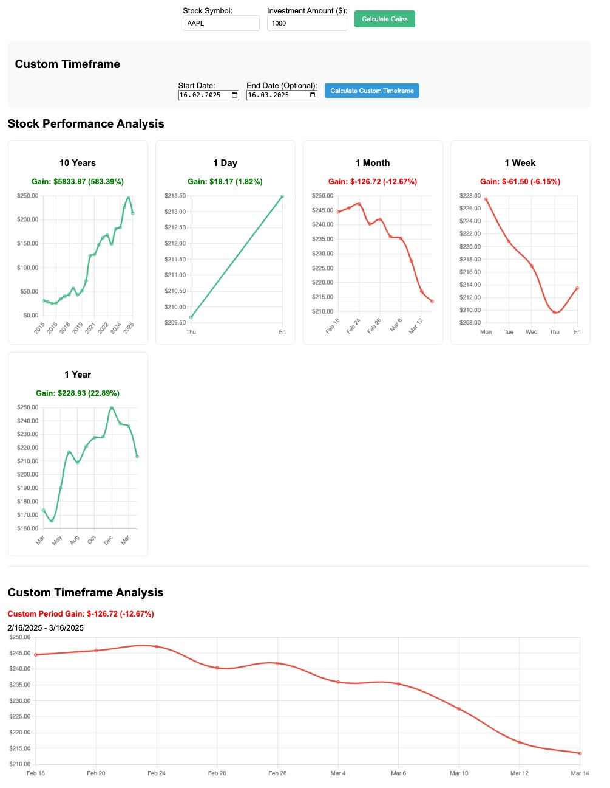

Are you tired of manually calculating stock gains? Whether you're a beginner or an experienced investor, understanding your investment returns is crucial. That's where the **[Stock Gains Calculator](https://stockgainscalculator.com)** comes in!

## What Is the Stock Gain Calculator?

The **[Stock Gains Calculator](https://stockgainscalculator.com)** is a free online tool that helps you:
- Calculate historical stock gains for **1 day, 1 week, 1 month, 1 year, or even 10 years**.
- Visualize stock performance with an interactive graph.
- Analyze custom timeframes to suit your investment strategy.

  
*Screenshot of the Stock Gain Calculator in action. Use this tool to calculate stock gains easily.*

## How to Use the Stock Gain Calculator

Using the calculator is simple:
1. **Enter the Stock Symbol**: Type in the stock symbol (e.g., AAPL for Apple or TSLA for Tesla).
2. **Choose a Timeframe**: Select from predefined timeframes (1 day, 1 week, 1 month, etc.) or enter custom dates.
3. **View the Results**: The calculator will display:
   - The stock's starting and ending prices.
   - Your total gain or loss.
   - A graph showing the stock's performance.

  
*Example graph showing stock performance over time. Analyze historical stock data with ease.*

## Why Use the Stock Gain Calculator?

- **Save Time**: No more manual calculations or spreadsheets.
- **Accurate Results**: Get precise numbers in seconds.
- **Visual Insights**: Understand trends with easy-to-read graphs.

## Example: Analyzing Apple Stock

Let’s say you invested $1,000 in Apple stock 1 year ago. Using the **[Stock Gains Calculator](https://stockgainscalculator.com)**, you can:
- See how much your investment is worth today.
- Analyze the stock's performance over the past year.
- Decide whether to hold or sell based on data-driven insights.

## Try It Now!

Ready to analyze your investments? Try the **[Stock Gains Calculator](https://stockgainscalculator.com)** today and take control of your financial future!

[CTA Button: Calculate Your Stock Gains Now!]

---

For more investing tips and tools, check out our [Investing Resources](/categories/investing).

> *Photo by [Austin Distel](https://unsplash.com/@austindistel) on [Unsplash](https://unsplash.com/).*
