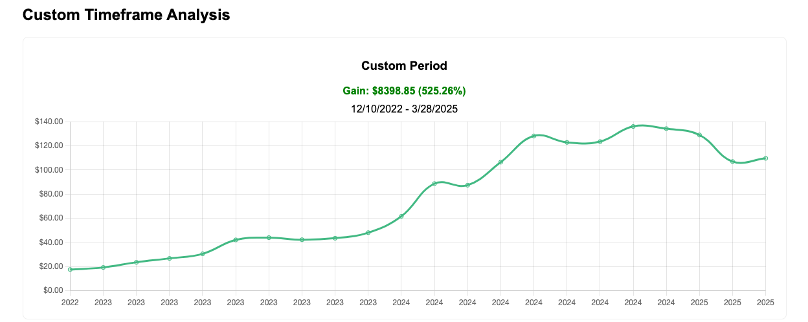

### **Introduction**  
The [NVIDIA GeForce RTX 4090](https://amzn.to/3FGqkgi) set new standards for gaming performance when it launched in late 2022. But what if you had complemented your hardware purchase with an investment in NVIDIA stock? Our analysis reveals how combining tech enthusiasm with strategic investing could have turned your $1,599 into **$8,398** - while still enjoying cutting-edge graphics.

---

#### **The RTX 4090 Launch**  
- **Launch Date**: October 12, 2022  
- **Original Price**: $1,599 ([Amazon](https://amzn.to/3FGqkgi))  
- **Key Features**:  
  - 24GB GDDR6X memory  
  - DLSS 3 technology  
  - 2-4x performance over previous gen  

#### **NVIDIA Stock at Launch**  
- **Price on 12/10/2022**: $112 (split-adjusted)  
- **Shares Purchasable**: ~14 shares  

---

#### **Investment Growth Calculation**  
Using [StockGainsCalculator.com](https://stockgainscalculator.com) data through March 28, 2025:  

**$1,599 Investment**:  
| Metric                | RTX 4090 Purchase | NVDA Stock Investment |
|-----------------------|-------------------|-----------------------|
| Initial Cost (2022)   | $1,599            | $1,599                |
| Current Value (2025)  | ~$1,100*          | **$8,398**            |
| ROI                   | -31%              | **+525.26%**          |

*Estimated used market value  

  
**Gain**: $8,398.85 (525.26%)  
**Timeframe**: 12/10/2022 - 3/28/2025  

---

#### **Key Takeaways**  
1. **Dual Growth Strategy**: The RTX 4090 delivers elite performance while NVIDIA stock gained 525%  
2. **AI Dividend**: NVIDIA's data center revenue grew 409% during this period  
3. **Smart Balance**: Investing just 20% of your GPU budget ($320) could have yielded ~$1,680  

---

### **Current Opportunities**  
- **For Gamers**: [RTX 4090 Founders Edition](https://amzn.to/3FGqkgi) (Flagship performance)  
- **Value Seekers**: [RTX 4080 Super](https://amzn.to/423bHuN) ($999 with excellent performance)  
- **Investors**: Use our [Stock Gain Calculator](https://stockgainscalculator.com) for other tech stocks  

---

### **Conclusion**  
While the RTX 4090 remains a technological marvel, NVIDIA's stock growth demonstrates the power of investing in innovation. By allocating even a portion of your tech budget to stocks, you can enjoy cutting-edge hardware while building long-term wealth.

---

### **Explore More**  
- [AMD GPU vs. Stock Comparison](/amd-gpu-investment)  
- [Intel CPU Investments](/intel-cpu-stock)  

---

### **Visual Credits**  
*GPU photo by [Thomas Foster](https://unsplash.com/@thomasfos), Chart via StockGainsCalculator*  

---

### **Affiliate Disclosure**  
*As an Amazon Associate, I earn from qualifying purchases.*  
